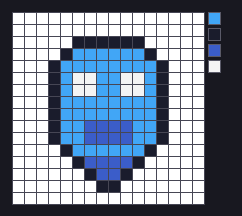
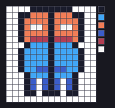

# Godot Pixel Studio

**A pixel-art game studio for Codex** — seven role skills that mirror how a small
game team divides its work, plus a deterministic pixel drawing tool. Built for
**Godot 4.x 2D pixel-art** projects.

Most attempts at "have an AI make me a pixel game" fail in one of two ways:

1. **The project never ships.** The model starts writing code before art direction
   and scope exist, so the game grows sideways across systems and content.
2. **The assets are unusable.** What comes back *looks* like pixel art but is
   anti-aliased (soft edges, hundreds of colours), off-palette, and at
   inconsistent sizes — so it cannot go into an engine without being redrawn.

This plugin addresses both: a workflow that forces design and art direction to
exist before code, and a drawing tool that produces exact, engine-ready pixels.

> This repository is a Codex plugin marketplace. It currently ships one plugin,
> `godot-pixel-studio`; the layout supports adding more under `plugins/`.



*That slime is rendered from a plain-text character grid — every pixel is
authored and deterministic, not sampled from a generative model.*

---

## Why not just generate the images?

Because a generated image is not a source file. You cannot diff it, you cannot
review it as a 3-line change, and you cannot say "move the eye one pixel left" and
get a precise result. And any anti-aliasing that leaks in has to be cleaned up by
hand, pixel by pixel.

So this plugin draws pixel art the way it is actually editable — as text:

```text
name: slime-idle-01
legend:
  ".": transparent
  "k": "#1a1c2c"   # outline
  "b": "#41a6f6"   # body base
  "B": "#3b5dc9"   # body shadow
  "w": "#f4f4f4"   # eye highlight
grid:
.....kkkkkk.....
....kbbbbbbk....
...kbwwbbwwbk...
...kbbBBBBbbk...
```

Run it through `grid` and you get a PNG whose every pixel is exactly what you
wrote — on palette, on grid, at the declared size. Change one character and
exactly one pixel changes.

## What's inside

### A studio of seven roles

| Skill | Role |
|---|---|
| `godot-pixel-studio` | **Director** — decides which discipline leads, and in what order |
| `game-designer` | Core loop, player verbs, and a hard **scope cap** |
| `pixel-art-director` | Art bible: base resolution, palette, and an explicit asset manifest |
| `pixel-artist` | Draws the sprites and tiles |
| `godot-programmer` | Godot 4 GDScript: movement, state machines, Resources, signals |
| `godot-scene-builder` | Node trees, `TileMapLayer`, collision layers, Y-sorting |
| `pixel-qa` | Runs the project and reports concrete defects with measurements |

The workflow is: **design brief → art bible → art → code → scenes → QA**, in small
loops with a QA gate between them.

### A deterministic pixel drawing tool

`scripts/pixel_draw.py` (Python + Pillow, no other dependencies).

The core idea: **pixel art needs per-pixel control, not probabilistic
generation.** So the main entry point turns a **character grid into a PNG**. The
result is exact, diff-able, and reviewable in a pull request.

```bash
python plugins/godot-pixel-studio/scripts/pixel_draw.py palette pico8
python plugins/godot-pixel-studio/scripts/pixel_draw.py grid --spec examples/slime-idle.txt --out slime.png
python plugins/godot-pixel-studio/scripts/pixel_draw.py preview --in slime.png --out slime-x8.png --scale 8 --grid-lines
```

| Command | Purpose |
|---|---|
| `grid` | Render a character grid to PNG (**core**) |
| `preview` | Integer-scaled preview with grid overlay and palette legend |
| `outline` | Add a 1px outline |
| `recolor` | Palette-swap to make enemy tiers / damage variants |
| `snap` | Force colours onto one palette |
| `sheet` | Assemble frames into a sprite sheet |
| `info` | Inspect size, colour count, bounding box |
| `mirror` | Flip horizontally |
| `palettes` / `palette` | Built-in palettes: `pico8`, `sweetie16`, `gameboy`, `1bit` |

Authoring a sprite looks like this:

```text
name: slime-idle-01
legend:
  ".": transparent
  "k": "#1a1c2c"   # outline
  "b": "#41a6f6"   # body base
  "B": "#3b5dc9"   # body shadow
  "w": "#f4f4f4"   # eye highlight
grid:
.....kkkkkk.....
....kbbbbbbk....
...kbwwbbwwbk...
...kbbBBBBbbk...
```

Symmetric characters can be authored as half a grid and mirrored
(`--mirror-x`):



### Reference documents

- `godot4-pixel-perfect.md` — project settings, texture filtering, camera
  rounding, the sub-pixel jitter problem, and a symptom → cause table
- `animation-and-spritesheet.md` — frame layout, anchor discipline, timing
- `palette-and-shading.md` — building shading ramps, outlines, dithering

## Install

This repository is a Codex plugin marketplace, so you can install straight from
it:

```bash
codex plugin marketplace add khalil852/godot-pixel-studio
codex plugin add godot-pixel-studio@pixel-studio
```

(The marketplace is named `pixel-studio`; the plugin inside it is
`godot-pixel-studio`.)

Then **restart Codex and open a new thread** — skills are loaded per thread, so an
existing session will not see the new roles.

Verify it worked by asking: *"what skills do you have available?"* — you should
see `godot-pixel-studio` and its six role skills.

## Requirements

- **Codex** with plugin support
- **Python 3.9+** with **Pillow** (`python -m pip install pillow`)
- **Godot 4.x** for the engine-side skills (developed against Godot 4.7)

## Quick start

Once installed, restart Codex and start a new thread:

> Start a Godot 4 pixel-art game. Write the design brief and art bible first.

The director skill will route to `game-designer` and `pixel-art-director` before
any code or art is produced. To draw something immediately:

> Draw a 16x16 pixel-art coin using the pico8 palette and show me the enlarged preview.

## Repository layout

```text
.
├── .agents/plugins/marketplace.json      # marketplace manifest
├── examples/                             # runnable grid specs + rendered output
├── docs/                                 # images for this README
└── plugins/godot-pixel-studio/
    ├── .codex-plugin/plugin.json
    ├── skills/                           # seven role skills
    ├── scripts/pixel_draw.py             # the drawing tool
    └── references/                       # Godot 4 and pixel-art reference docs
```

## Design notes

- **Why seven separate skills instead of one big prompt?** Each discipline has
  hard rules that pull against the others — design wants scope, art wants
  consistency, QA wants evidence. Keeping them separate keeps those rules
  enforceable, and mirrors how roles are actually separated on a team.
- **Why insist on an artifact manifest?** A sprite's pixel size and anchor are
  contracts between art and code. Undeclared sizes are the root cause of popping
  animation and collision drift, so the manifest makes them explicit before
  anything is drawn.
- **Why is `info` a first-class command?** Verification should be a command, not
  an opinion. "Is this sprite 16×24 with 5 colours?" is answerable; "does it look
  right?" is not.

## License

MIT — see [LICENSE](LICENSE).

---

## 中文说明

这是一个给 **Codex** 用的「Godot 4 像素风游戏工作室」插件：7 个角色 skill
（导演 / 策划 / 美术总监 / 像素画师 / 程序 / 场景 / QA）加一个**确定性像素绘画工具**。

核心设计：**像素画靠精确控制每个像素，不靠概率生成**。所以作画主入口是
「字符网格 → PNG」——用调色板字符写网格，输出完全确定、可 diff、可复查，
而不是让模型生成一张带抗锯齿、调色板混乱、尺寸不一的图。

安装后需要**重启 Codex 并开新会话**（skill 按会话加载，旧会话看不到新角色）。

示例即仓库里的 `examples/`：`slime-idle.txt` 是显式 `legend` 写法，
`hero-idle-half.txt` 演示对称角色只画左半再用 `--mirror-x` 镜像，
`grass-tile.txt` 演示直接用内置调色板索引。

依赖：Python 3.9+ 与 Pillow；引擎侧针对 Godot 4.x（开发时用的是 4.7）。
