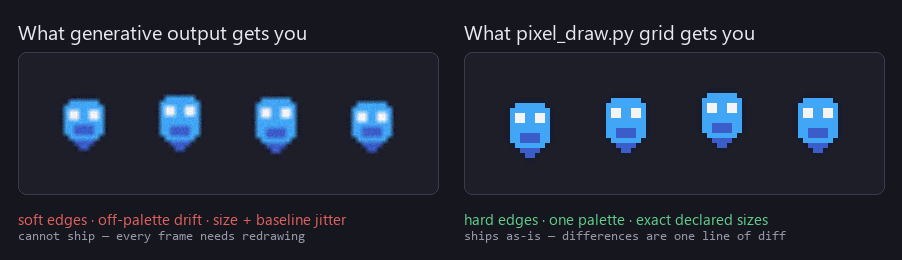

# Pixel Studio

A Codex plugin marketplace for making games with agents — where the art is
**authored, not generated**.

Three plugins. Every tool in them is deterministic, and every claim below is
measurable.

| Plugin | What it does |
|---|---|
| **[pixel-art-forge](plugins/pixel-art-forge/)** | Higher-resolution pixel art and game UI, plus an audit for the defects that make pixel art read as machine-made. 25 commands, 1747 lines, Pillow only. |
| **[godot-pixel-studio](plugins/godot-pixel-studio/)** | A Godot 4.x 2D pixel-art crew: seven role skills (design, art direction, sprites, GDScript, scenes, QA) and a deterministic character-grid drawing tool. |
| **[game-studio-sim](plugins/game-studio-sim/)** | A collaboration protocol for game projects: four permanent roles, five checkpoints, and exactly one owner per decision. |

---

## Install

```bash
codex plugin marketplace add khalil852/godot-pixel-studio
codex plugin add pixel-art-forge@pixel-studio
codex plugin add godot-pixel-studio@pixel-studio
codex plugin add game-studio-sim@pixel-studio
```

The skills are also plain `SKILL.md` files, so any harness that reads the Agent
Skills layout can use them — copy a skill directory into `~/.agents/skills/` or
`~/.claude/skills/` and it works unchanged. Each skill is self-contained (its own
`scripts/` and `references/`), so its relative paths keep resolving wherever it
lands.

---

## Why not just generate the images



A generated image is not a source file. You cannot diff it, you cannot review it as
a three-line change, and you cannot say "move the eye one pixel left" and get a
precise result. So the drawing entry point is text:

```text
name: slime-idle-01
legend:
  ".": transparent
  "k": "#1a1c2c"   # outline
  "b": "#41a6f6"   # body base
grid:
.....kkkkkk.....
....kbbbbbbk....
...kbwwbbwwbk...
```


Run it through `grid` and every pixel is exactly what you wrote — on palette, on
grid, at the declared size. Change one character and exactly one pixel changes.

Above roughly 32px, hand-authoring a grid stops being readable (4096 decisions at
64×64), so the work becomes **constructive**: crisp primitives, banded shading from
a declared light direction, one forced feature scale, and noise removal.

---

## "AI feel" is measurable, so it is measured

`pixel-art-forge` ships an audit with eight checks, each tied to a specific defect:

| Check | The defect it catches |
|---|---|
| colour count / palette drift | colours that are not in the project's palette |
| anti-alias suspects | pixels that are blends of two other colours |
| isolated pixels | single pixels with no neighbour — grain, not detail |
| dominant run length | mixed feature scale (the "upscaled small sprite" tell) |
| banded shading | adjacent tones too close in luminance — airbrushed, not shaded |
| light consistency | highlights not on the declared light side, per material |
| silhouette cleanliness | 1px notches and spikes on the outline |
| *(with `--ui`)* border thickness, interior flatness | broken UI frames; detail where a panel should be empty |

Verified to discriminate rather than merely to pass:

- A sprite built through the constructive pipeline: **8/8**.
- The same sprite deliberately degraded (bilinear round-trip, colour jitter,
  speckle): **1/8** — 93,149 anti-alias suspects, 778 near-tone seams, 44 edge
  spikes, and the light direction inverted.
- Sprites pass `--ui`'s flatness check by failing it, and UI passes it by
  satisfying it — a sprite interior scores ~25% in one tone across a dozen tones,
  a panel scores 95% across three.

---

## What testing changed about this project

Two controlled experiments, both run against a text-only model, both with the
result kept even when it was inconvenient:

**Knowledge in documentation did nothing.** A ~1400-word reference on pixel-art
craft and per-genre design strategy was written, installed, and A/B tested. The
agent read it (verifiable in the session log) and produced output of the same
quality as without it — while its session grew **3×**. Its two sharpest design
insights were not in the reference. Conclusion: a capable model already knows this
material; explaining art to it is writing for the author, not for the model. The
reference was removed and replaced with measured numbers, which *did* change
behaviour: at 96×96 the agent calibrated against the documented 64×64 profile —
"dominant run 2px at 37%" — narrowed its body, and pulled the sprite to the same
profile.

**Specification in the prompt did a lot.** The same task as a filled-in
[asset brief](plugins/pixel-art-forge/skills/pixel-art-forge/assets/asset-brief.txt)
— naming `must read as`, fixing the block size, requiring the report to state what
the agent could *not* verify — produced measurably deeper work: a parameter sweep
run specifically to rule out a hypothesis (proving a shading problem was geometric
rather than a ramp-tuning issue), a quantified trade-off between one and two
outline passes, and four additional unverified items flagged, including that engine
import must use nearest-neighbour or the whole exercise is void.

The rule that came out of it: **the skill earns its place by specifying process and
reporting, not by supplying knowledge.** `references/target-profiles.md` exists
because numbers worked and prose did not.

---

## Repository layout

```text
.
├── .agents/plugins/marketplace.json      # the marketplace manifest
├── plugins/
│   ├── pixel-art-forge/
│   │   └── skills/pixel-art-forge/       # SKILL.md, scripts/, references/, assets/
│   ├── godot-pixel-studio/
│   │   └── skills/                       # seven role skills
│   └── game-studio-sim/
│       └── skills/game-studio-sim/
├── examples/                             # runnable grid specs + a Godot demo project
└── docs/                                 # figures, GIF, and the scripts that generate them
```

Both figure scripts are committed and read their sprites through the real drawing
code, so the images cannot drift from the tool's behaviour.

---

## License

MIT — see [LICENSE](LICENSE).

---

## 中文说明

一个 Codex 插件市场，做**"作者画出来"而不是"模型生成"**的游戏美术。

三个插件：**pixel-art-forge**（高分辨率像素画与游戏 UI + 可测量的"AI 感"检查）、
**godot-pixel-studio**（Godot 4 的七角色工作室 + 确定性字符网格绘画）、
**game-studio-sim**（协作协议：四个常驻角色、五个检查点、每个决策唯一责任人）。

核心主张：**"AI 感"不是玄学，是七项可测量的缺陷**——抗锯齿混色、色板漂移、孤立像素、
特征尺度混乱、渐变式明暗、光照不一致、轮廓毛刺。前六项从构造上禁止，第七项由 `audit` 拦截。
实测区分度：正常流程产出的资产 8/8 通过，人为劣化的 1/8。

README 里那两段实验结论也建议看：**给模型解释美术原理基本无效**（它本来就会，装上去只会让
会话膨胀 3 倍），**但把它要遵守的流程和汇报要求写清楚非常有效**。
