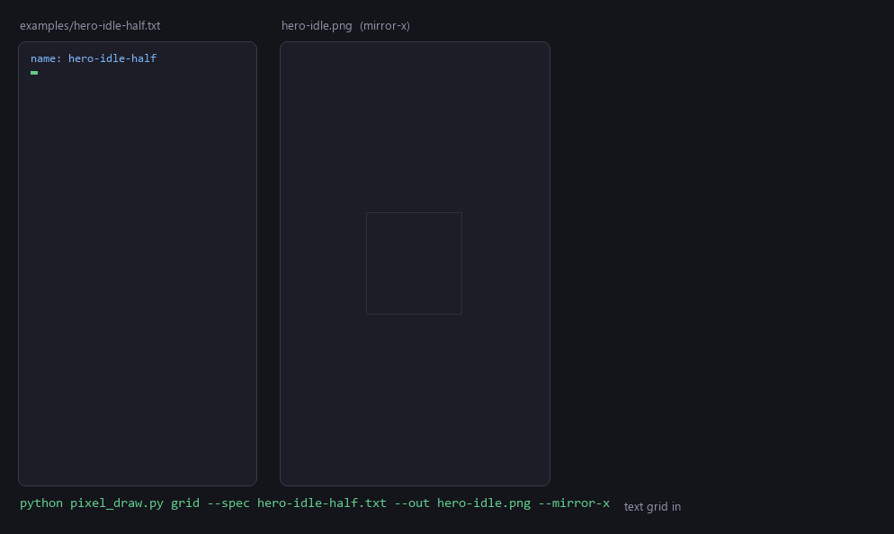

# Godot demo scene

A 30-line scene that loads the three PNGs from `examples/` and does nothing else,
so you can confirm for yourself that the output of `pixel_draw.py` is engine-ready
with no cleanup step in between.



## What it demonstrates

- The sprites drop in and render with **no editing, resampling, or re-exporting**.
- The 16×16 tile repeats across the ground with **no seams**, which only holds if
  the tile really is 16×16.
- Motion is quantised to whole pixels (`int(round(...))`), because sub-pixel
  movement is exactly what makes pixel art shimmer.
- Filtering is nearest via the project setting, with a per-node override in
  `main.gd` so the behaviour is visible in the code rather than only in a menu.

## Run it

```bash
godot --path . --editor      # open in the editor
godot --path .               # just run it
```

Tested against **Godot 4.7.1**. The project targets the GL Compatibility renderer
so it runs on integrated GPUs and in CI.

## Assets

The three PNGs here are copies of `../hero-idle.png`, `../slime-idle.png` and
`../grass-tile.png`, because Godot can only load resources under the project root.
Their source grids live next to the originals as `.txt` specs.

Their `.import` sidecars are committed on purpose: they carry
`mipmaps/generate=false` and `fix_alpha_border=true`, which are the settings pixel
art needs. Without them a fresh clone would re-import with defaults.

## Capturing the README GIF segment

```bash
godot --headless --path . --import
godot --path . --write-movie /tmp/frames/f.png --fixed-fps 12 --quit-after 36
python ../docs/make_gif.py --game-frames /tmp/frames
```
